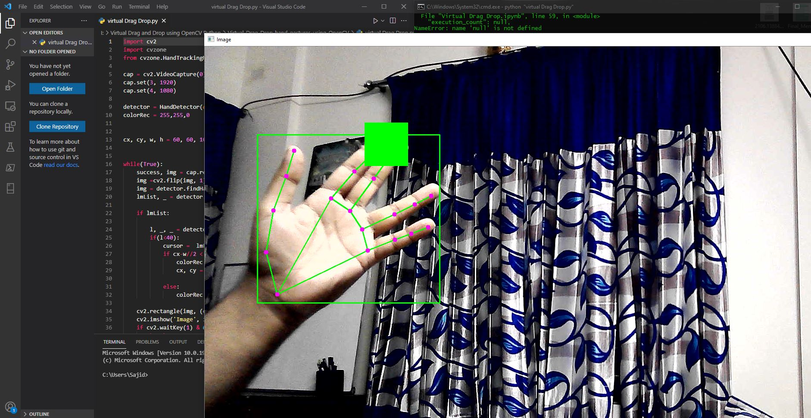

# Virtual Drag and Drop Hand Gestures Testing using OpenCV

This project involves image processing and AI functions for detecting hand gestures and implementing virtual drag and drop functionality. It utilizes the OpenCV and Mediapipe libraries.

## Installation

You can install the required libraries using pip:

```bash
pip install cvzone
pip install mediapipe
```

<hr>

### 60 FPS Drag and Drop Hand Gesture Detection

Development is in progress.



</hr>

## Contribution

Contributions to this project are welcome. Feel free to open issues or submit pull requests to improve the functionality or documentation.

## License

This project is licensed under the [MIT License](LICENSE).
